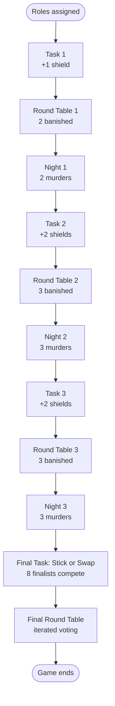

# The Traitors — Game Plan

A planning document for the **Unlicensed 14 Club Edition**: a single-event social-deduction game for ~24 players, run by **two hosts**.

## Overview

Each player is secretly assigned **Faithful** or **Traitor**. The game runs over three days — *task → round table → night* — and ends with a final task and final round table.

- **Faithful win** if every Traitor has been eliminated by the time the Final ends.
- **Traitors win** if at least one Traitor survives the Final.

## Game Flow

## Composition

Roughly 1 Traitor per 6 players.

| Players (N) | Traitors |
|-------------|----------|
| 18–20       | 3        |
| 21–25       | 4        |
| 26–30       | 5        |

## Schedule

### Recommended (N = 24)

| Day | Banishments | Murders | Eliminated | Surviving |
|-----|-------------|---------|------------|-----------|
| 1   | 2           | 2       | 4          | 20        |
| 2   | 3           | 3       | 6          | 14        |
| 3   | 3           | 3       | 6          | 8         |

**8 players enter the Final.** Murder counts are fixed by the schedule — Traitors choose targets, not quantity.

### Scaling

| N  | Schedule (B/M per day)        | Finalists |
|----|-------------------------------|-----------|
| 18 | 1/1, 2/2, 2/2                 | 8         |
| 20 | 1/1, 2/2, 3/3                 | 8         |
| 22 | 2/2, 2/2, 3/3                 | 8         |
| 24 | 2/2, 3/3, 3/3                 | 8         |

## Shields

- **Won from daily tasks** — top 1–2 finishers per task.
- **Single-use, one-night-only** — protects from the next night's murder, then expires.
- **Public** — held shields are visible to all. Traitors will avoid shielded targets, so the shield's real value is that the holder can speak boldly at the round table.
- **Enforced server-side** — a shielded player can't be marked Murdered.

| Task   | Shields |
|--------|---------|
| Task 1 | 1       |
| Task 2 | 2       |
| Task 3 | 2       |
| **Total** | **5** |

5 shields across 24 players ≈ 1 in 5 — wanted but rare.

## Tasks

All tasks must be invigilatable by **the two hosts together** (not two per group). Eliminated players still take part for engagement but cannot win shields.

| When  | Task                 | Description                                                                                                    | Team size   | Winners                       |
|-------|----------------------|----------------------------------------------------------------------------------------------------------------|-------------|-------------------------------|
| Day 1 | The Riddle Race      | 3–5 prepared riddles solved in parallel; first team to bring a fully correct sheet to a host win.            | ~4 players  | First team (1 shield) |
| Day 2 | Hula Hoop Pass       | Teams link arms in a circle; fastest team to pass the hula hoop all the way around without breaking the chain wins. | ~8 players        | Fastest team (1 shield) |
| Day 2 | 100-Item Memory      | A picture of 100 items is shown on screen for a set time; teams recall as many items as they can. Hosts check against the answer sheet. | ~4 players        | Most items recalled (1 shield) |
| Day 3 | Paper Aeroplane      | Teams construct paper aeroplanes; the plane that flies the furthest wins.                                       | ~3 players        | Longest flight (1 shield) |
| Day 3 | Solo Cup Challenge   | 10 solo cups are arranged; first team to land a ball in all of them wins.                                       | ~6 players        | First team to fill all cups (1 shield) |
| Final | Stick or Swap         | Single-elimination bracket. Each round, two players draw a card, one looks at theirs, the other one has to decide to stick or swap. Highest card wins. | 1 v 1       | Bracket winner (special prize, see below) |

### Final task prize

The winner of the Final Task gets to select one of the other finalists to go into a seperate room, where they have to tell them truthfully whether they are a Traitor or a Faithful. 

## Shopping list

Quantities assume **~24 players, 2 hosts**. Adjust if headcount changes.

### Core game props
- [ ] **Shield tokens** ×3 — 2 awarded across tasks + 1 spare. Physical & visible.
- [ ] **Whiteboards and markers** ×24 — plus a few spares (they dry out).
- [x] **Traitors costumes** ×2 — for round-table / reveal drama.
- [ ] **Blindfolds** x24 - plus a few spares

### Day 1 — The Riddle Race
- [ ] **Printed riddle sheets** ×10 — ~6 teams + spares.
- [ ] **Pens** ×12 — one per team + spares.
- [ ] **Master answer sheet** ×1 — host copy for checking.

### Day 2 — Hula Hoop Pass & 100-Item Memory
- [ ] **Hula hoops** ×2 — 1 in use + spare.
- [ ] **100-item picture** ×1 — prepared in advance.
- [ ] **Blank paper** ×30 — ~6 teams + spares.
- [ ] **Master answer sheet (display on screen)** ×1 — host copy of all 100 items.

### Day 3 — Paper Aeroplane & Solo Cup Challenge
- [ ] **Blank paper** ×1 ream (500) — plenty for building + retries.
- [x] **Tape measure / long measuring tape** ×1 — to judge furthest flight (10m+ ideal).
- [ ] **Solo cups** ×10 — reusable.
- [ ] **Balls (ping-pong)** ×1 pack (~12) — for the cup challenge.

### Final — Stick or Swap
- [x] **Stick or Swap cards** ×1 deck — normal playing cards.

## To do list:
- [x] Fill in text on rules page
- [ ] Make custom pages for Tasks 1, 2, 3 and Final Task (including rules, 100-item picture, etc.)
- [ ] Complete profile pictures
- [ ] Research how to make the app play music during Night Stages