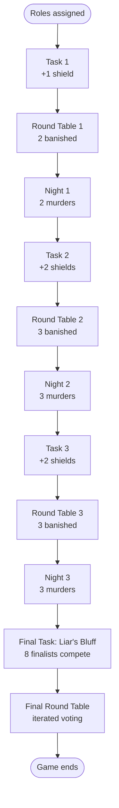

# The Traitors — Game Plan

A planning document for the **Unlicensed 14 Club Edition**: a single-event social-deduction game for ~24 players, run by **two hosts**.

## Overview

Each player is secretly assigned **Faithful** or **Traitor**. The game runs over three days — *task → round table → night* — and ends with a final task and final round table.

- **Faithful win** if every Traitor has been eliminated by the time the Final ends.
- **Traitors win** if at least one Traitor survives the Final.

## Game Flow

## Composition

Roughly 1 Traitor per 6 players.

| Players (N) | Traitors |
|-------------|----------|
| 18–20       | 3        |
| 21–25       | 4        |
| 26–30       | 5        |

## Schedule

### Recommended (N = 24)

| Day | Banishments | Murders | Eliminated | Surviving |
|-----|-------------|---------|------------|-----------|
| 1   | 2           | 2       | 4          | 20        |
| 2   | 3           | 3       | 6          | 14        |
| 3   | 3           | 3       | 6          | 8         |

**8 players enter the Final.** Murder counts are fixed by the schedule — Traitors choose targets, not quantity.

### Scaling

| N  | Schedule (B/M per day)        | Finalists |
|----|-------------------------------|-----------|
| 18 | 1/1, 2/2, 2/2                 | 8         |
| 20 | 1/1, 2/2, 3/3                 | 8         |
| 22 | 2/2, 2/2, 3/3                 | 8         |
| 24 | 2/2, 3/3, 3/3                 | 8         |

## Shields

- **Won from daily tasks** — top 1–2 finishers per task.
- **Single-use, one-night-only** — protects from the next night's murder, then expires.
- **Public** — held shields are visible to all. Traitors will avoid shielded targets, so the shield's real value is that the holder can speak boldly at the round table.
- **Enforced server-side** — a shielded player can't be marked Murdered.

| Task   | Shields |
|--------|---------|
| Task 1 | 1       |
| Task 2 | 2       |
| Task 3 | 2       |
| **Total** | **5** |

5 shields across 24 players ≈ 1 in 5 — wanted but rare.

## Tasks

All tasks must be invigilatable by **the two hosts together** (not two per group). Eliminated players still take part for engagement but cannot win shields.

| When  | Task                 | Description                                                                                                    | Winners                       |
|-------|----------------------|----------------------------------------------------------------------------------------------------------------|-------------------------------|
| Day 1 | The Riddle Race      | 3–5 prepared riddles solved in parallel; first players to bring a fully correct sheet to a host win.            | First finisher (1 shield) |
| Day 2 | Two Truths and a Lie | Each player writes 2 truths + 1 lie; cards read anonymously; everyone guesses which is the lie.                 | Top scorer (2 shields)         |
| Day 3 | Find the Tokens      | Hosts hide ~30 small tokens in a defined area; players have 5 minutes to find as many as they can.              | Top 2 collectors (2 shields)  |
| Final | Liar's Bluff         | Single-elimination bracket. Each round, one player draws a secret lie/truth card, deliver a one-sentence statement, and guess whether the other lied. | Bracket winner (special prize, see below) |

### Final task prize

The winner of the Final Task gets to select 1 of the other finalists to go into a seperate room, where they have to tell them truthfully whether they are a Traitor or a Faithful. 

## Other mechanics

- **The Final** is iterated round-table voting (one out per round). The group may elect to end the game at the start of any round; surviving Traitors are then revealed and Traitors win if any remain.
- **Recruitment** — Traitors may recruit a Faithful mid-game (e.g. after losing a teammate). Mechanic to be designed.
- **Tie-breaking at the round table** — re-vote between tied players; if still tied, run a second re-vote between just those players.
- **Eliminated players** participate in tasks but cannot win shields, attend the round table, or be eliminated again.
